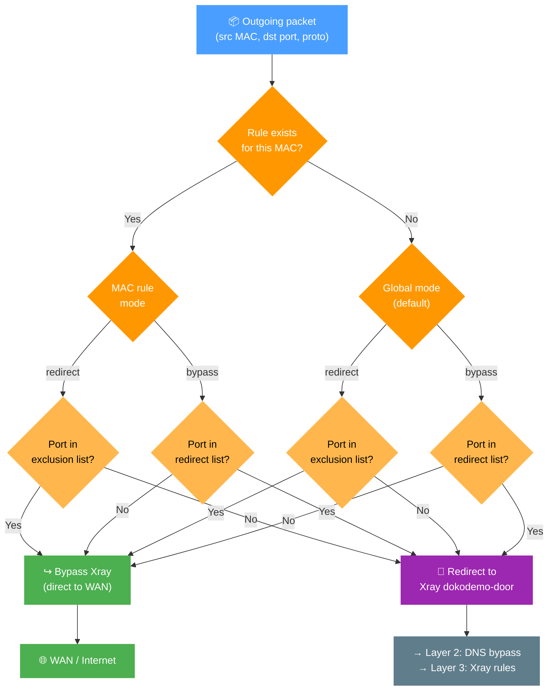

# Bypass/Redirect Policy

The `Bypass/Redirect Policy` allows you to fine-tune how traffic is handled by Xray on a per-port or per-device (MAC address) basis.

- **Bypass** means traffic does **not** go through Xray by default, unless you explicitly specify certain ports to be redirected.
- **Redirect** means traffic **does** go through Xray by default, unless you explicitly exclude certain ports.

> [!info]
> B/R Policies are rules applied just before traffic is routed through the Xray service.

## Why Use It?

You might have devices or applications that you do not want to proxy—perhaps internal services or local game servers.

Conversely, you might want to proxy only specific ports (e.g., `443`) while leaving all other traffic untouched.

Or, you may need a particular device (e.g., your PC) to be fully redirected to Xray, while excluding certain ports for that device.

This flexible policy system lets you achieve all these scenarios and more.

## Policy Schema

To manage B/R Policies, click the **Manage** button in the **Routing** section.

> [!info]
> By default, if no rules are specified, a dynamic general rule is applied: **all traffic is redirected** to the Xray process.

## Decision Logic

The chart below shows how XRAYUI decides whether to intercept a given packet. The check runs at the iptables level before traffic ever reaches Xray.

> [!tip]
> A per-MAC rule always wins over the global rule. Ports act as "mode exceptions": in `redirect` mode they bypass Xray, in `bypass` mode they go into Xray.

## Examples

Below is a table arranged from the simplest configuration (only setting a mode) to more detailed ones (specifying ports and devices). This helps illustrate how different combinations change the final behavior.

| #   | Configuration          | Example (simplified)                | Effect on Devices                                                                               |
| --- | ---------------------- | ----------------------------------- | ----------------------------------------------------------------------------------------------- |
| 1   | Only bypass            | mode: bypass, no MAC/ports          | All traffic `bypasses` Xray (nothing is redirected).                                            |
| 2   | Only redirect          | mode: redirect, no MAC/ports        | All traffic is `redirected` to Xray (no excluded ports).                                        |
| 3   | bypass + port          | mode: bypass, tcp/udp=5060          | Traffic on port 5060 is `redirected` to Xray; all other traffic bypasses Xray.                  |
| 4   | redirect + port        | mode: redirect, tcp/udp=5060        | Traffic on port 5060 `bypasses` Xray; all other traffic is redirected.                          |
| 5   | bypass + MAC           | mode: bypass, mac=AA:BB...          | All traffic for that device `bypasses` Xray (no ports specified to redirect).                   |
| 6   | redirect + MAC         | mode: redirect, mac=AA:BB...        | All traffic for that device is `redirected` (no excluded ports). Other devices are unaffected.  |
| 7   | redirect + MAC + ports | mode: redirect, mac=..., ports=5060 | For that device: traffic on port 5060 bypasses Xray; all other traffic is `redirected`.         |
| 8   | bypass + MAC + ports   | mode: bypass, mac=..., ports=5060   | For that device: traffic on port 5060 is redirected to Xray; all other traffic `bypasses` Xray. |
