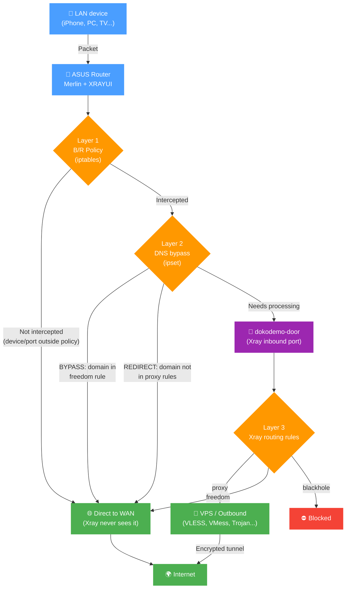

# Routing Rules

Routing rules determine which outbound handles specific traffic: proxy, direct (`freedom`), or block (`blackhole`). Rules are evaluated **top to bottom** — first match wins.

## How Traffic Reaches Xray

Not all traffic automatically goes through Xray. There are three processing layers, and each one only works with what passed through the previous one.



> [!note]
> Before any of the three layers, XRAYUI unconditionally excludes service traffic: DHCP (67/68), NTP (123), IPsec/WireGuard (500/4500/4501/51820), multicast/broadcast, packets originated by the router itself, and traffic already in a DNAT state (inbound port-forwards). These packets never reach Xray, even if a policy would otherwise intercept them.

### Layer 1: Interception (B/R Policies)

[Bypass/Redirect policies](br-policy.md) determine which devices and ports are intercepted. Traffic that isn't intercepted goes direct — Xray never sees it.

### Layer 2: DNS Bypass (before Xray)

Intercepted traffic can be further filtered **before** reaching Xray. This reduces router CPU load but limits routing flexibility.

By default, all intercepted traffic is redirected to Xray's dokodemo-door inbound port. On weak routers, this creates high CPU load under heavy traffic. DNS bypass solves this by filtering traffic at the iptables/ipset level before Xray.

#### Modes

- **OFF** — all intercepted traffic goes to Xray. Routing rules work fully.

- **BYPASS** — extracts domains from rules with `freedom` outbound type. Traffic to those domains **skips Xray** and goes direct. For example, a rule `domain:ru` → `freedom` means all `.ru` traffic bypasses Xray. Everything else enters Xray.

- **REDIRECT** — inverse of BYPASS. Extracts domains from rules with outbound type **other than** `freedom`, and only that traffic enters Xray. For example, a rule `geosite:youtube` → `proxy` means only YouTube traffic enters Xray; everything else goes direct.

> [!important]
> DNS bypass operates **before** Xray routing rules. Traffic filtered at this layer never reaches Xray, and routing rules won't apply to it.

> [!note]
> Geodata categories occasionally contain entries with the `regexp:` prefix. These are ignored by DNS bypass — ipset doesn't support regular expressions.

### Layer 3: Xray Routing Rules

Traffic that passes through the previous layers is processed by Xray's routing rules — the rest of this document covers them.

## Domain Syntax

### Prefixes

| Prefix        | Behavior                  | Example                                                   |
| ------------- | ------------------------- | --------------------------------------------------------- |
| `domain:`     | Domain + all subdomains   | `domain:google.com` → `google.com`, `maps.google.com`     |
| `full:`       | Exact match only          | `full:google.com` → only `google.com`                     |
| `keyword:`    | Contains substring        | `keyword:google` → `google.com`, `mygooglesite.net`       |
| `regexp:`     | Regular expression        | `regexp:.*\.edu$` → `harvard.edu`, `mit.edu`              |
| `geosite:`    | Geosite database category | `geosite:netflix` → all Netflix domains                   |
| `ext:xrayui:` | Custom domain list       | `ext:xrayui:mylist` → domains from your custom list       |

### `domain:` matching examples

- `domain:com` — all `.com` domains and their subdomains
- `domain:dmn.com` — `dmn.com`, `www.dmn.com`, `sub.domain.dmn.com`
- `domain:www.dmn.com` — only `www.dmn.com` and its subdomains, not `dmn.com`

## Geosite Databases

Geosite files are community-maintained lists of domains grouped by category. Instead of manually listing dozens of domains for a service, you can use a single category tag.

Example — `geosite:youtube` includes `youtube.com`, `youtu.be`, `youtube-nocookie.com`, CDNs, regional domains, etc.

### Common Categories

| Category                       | Description                    |
| ------------------------------ | ------------------------------ |
| `geosite:google`               | All Google services            |
| `geosite:youtube`              | YouTube and related domains    |
| `geosite:netflix`              | Netflix                        |
| `geosite:facebook`             | Facebook and Instagram         |
| `geosite:twitter`              | Twitter/X                      |
| `geosite:telegram`             | Telegram                       |
| `geosite:spotify`              | Spotify                        |
| `geosite:category-ads-all`     | Ad networks                    |
| `geosite:category-media-ru`    | Blocked media in Russia        |
| `geosite:cn`                   | Chinese domains                |
| `geosite:geolocation-!cn`      | Non-Chinese domains            |

Full list of categories: [v2fly/domain-list-community](https://github.com/v2fly/domain-list-community/tree/master/data)

### Updating Databases

**Manual:** Routing → **Update community files** → Apply

**Automatic:** General Options → Geodata → **Auto-update geodata files** (updates at 03:00)

### Custom Lists

You can create your own domain categories and use them in rules as `ext:xrayui:name`. Details: [Geodata Files Manager](custom-geodata).

## GeoIP

| Category           | Description             |
| ------------------ | ----------------------- |
| `geoip:cn`         | Chinese IP addresses    |
| `geoip:us`         | US IP addresses         |
| `geoip:private`    | Private/LAN addresses   |
| `geoip:cloudflare` | Cloudflare IPs          |

## Managing Rules

### Interface

1. Go to the **Routing** section
   
2. Click **Manage** next to **Rules**
   

### Adding a Rule

Click **Add new rule**. Fill in the fields:

| Field                   | Description                                 |
| ----------------------- | ------------------------------------------- |
| **Friendly Name**       | Descriptive name for the rule               |
| **Outbound connection** | Where to send traffic: proxy, direct, block |
| **Enabled**             | Toggle rule on/off                          |

### Matching Criteria


A rule can have one or more criteria. When multiple are specified, **AND** logic applies — all conditions must match.

> [!tip]
> If nothing is selected in a field, everything matches. You don't need to select all options to cover all traffic — just leave the field blank.

#### Domains

One per line. Supported formats: `domain:`, `full:`, `keyword:`, `regexp:`, `geosite:`, `ext:xrayui:`.

> [!tip]
> The **geosite:** and **ext:xrayui:** buttons above the input field insert the prefix. Autocomplete helps find available tags.

#### IP Addresses

```text
192.168.1.1
192.168.1.0/24
geoip:cn
geoip:private
```

#### Source IPs

Filter by source device IP:

```text
192.168.1.100
192.168.1.0/24
```

#### Ports

```text
443
8080:8090
```

> [!note]
> Use colon (`:`) for ranges, not a hyphen.

#### Networks

- **tcp** — TCP only
- **udp** — UDP only (including QUIC/HTTP3)
- Empty — both

#### Protocols

- **http**, **tls**, **bittorrent**, **quic**

Detected by packet inspection, not port numbers.

### Rule Order

Use the up/down buttons to reorder rules. More specific rules go higher, catch-all rules at the bottom.

### Saving

1. **Save** in the rule editor
2. **Apply** on the main page

### System Rules

Some rules are auto-generated (DNS, B/R policies). They can't be edited directly but can be disabled.

### Disabling Rules

Uncheck a rule's checkbox — it moves to the "disabled" section and retains its configuration.

## Example Rules

### Netflix via proxy

```yaml
Friendly Name: Netflix proxy
Outbound: proxy
Domains: geosite:netflix
```

### Block ads

```yaml
Friendly Name: Block ads
Outbound: block
Domains: geosite:category-ads-all
```

### Local network direct

```yaml
Friendly Name: LAN direct
Outbound: direct
IPs:
  geoip:private
```

### Torrents direct

```yaml
Friendly Name: Torrents direct
Outbound: direct
Protocols: bittorrent
```

### Specific device HTTPS via proxy

```yaml
Friendly Name: Laptop HTTPS proxy
Outbound: proxy
Source IPs: 192.168.1.100
Ports: 443
Networks: tcp
```

## Common Routing Schemes

### Proxy everything except local

```yaml
Rule 1 — direct: IPs: geoip:private
Rule 2 — proxy:  (empty criteria = catch-all)
```

### Only specific services via proxy

```yaml
Rule 1 — proxy:  Domains: geosite:netflix, geosite:youtube
Rule 2 — direct: (catch-all)
```

### Bypass regional restrictions (Russia)

```yaml
Rule 1 — proxy:  Domains: geosite:category-media-ru
Rule 2 — direct: Domains: geosite:ru
Rule 3 — proxy:  Domains: geosite:geolocation-!ru
```

### Performance optimization with DNS bypass

```yaml
DNS Bypass: REDIRECT mode
B/R Policy: Redirect ports 80,443

Rules:
1. geosite:youtube → proxy
2. geosite:netflix → proxy
```

Only YouTube and Netflix go through Xray. Everything else bypasses at the iptables level.

### Maximum control

```yaml
DNS Bypass: OFF
B/R Policy: Redirect all

Rules:
1. domain:company.com → work-proxy
2. geosite:netflix → us-proxy
3. geosite:twitter → europe-proxy
4. ports:27000-27100 → direct
5. (catch-all) → proxy
```

All traffic goes through Xray for evaluation.

## Advanced

### Domain Matcher


- **hybrid** (default) — balanced speed and accuracy
- **linear** — sequential matching, more accurate but slower

### Balancers

Rules can route traffic to balancers instead of a single outbound:

```yaml
Outbound: balancer-us
```

## Troubleshooting

### Rules not working

1. **DNS bypass** — traffic may be filtered before Xray. Temporarily set to OFF to test.
2. **B/R policies** — traffic may not be intercepted. Check MAC addresses and ports.
3. **Rule order** — specific rules must be above general ones.
4. **Outbound** — verify the specified outbound exists.
5. **Syntax** — `domain:` not `domain.`, `geosite:` not `geosite.`.

### Traffic not being proxied

- DNS bypass in REDIRECT mode with the domain matching a `freedom` rule
- B/R policy doesn't include the needed ports
- QUIC/HTTP3 (UDP 443) not intercepted — add UDP 443 to the policy

### Unexpected direct connections

- Ipset rules from DNS bypass creating kernel-level bypasses
- IPv6 traffic not being handled
- Cached DNS responses from a previous configuration

### Debugging

Enable logs: General Options → Logs → **Access logs**, level `info` or `debug`.

```bash
tail -f /tmp/log/xray_access.log
```

> [!note]
> After any changes, click **Apply** on the main page to activate the new configuration.
