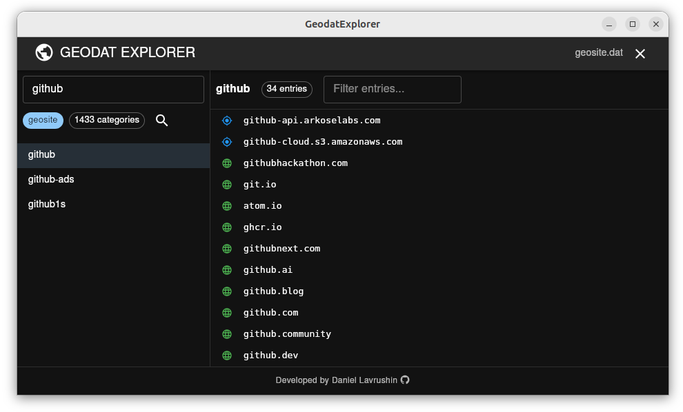

# Using v2dat to Inspect Geosite and GeoIP Databases

## What is v2dat?

v2dat is a CLI tool included with **XRAYUI** that allows you super fast to inspect and extract contents from `geosite.dat` and `geoip.dat` files.

v2dat is an essential tool for understanding and debugging your xrayui routing configuration. Use it whenever you need to verify what traffic your rules will actually match.

This is invaluable for:

- Understanding what domains/IPs are included in specific categories
- Debugging routing rules
- Verifying custom geosite compilations
- Finding the right category for your needs

## GeodatExplorer — a GUI viewer

If the command line isn't your thing, take a look at [**GeodatExplorer**](https://github.com/DanielLavrushin/GeodatExplorer) — a desktop app (by the same author as XRAYUI) for browsing `geosite.dat` and `geoip.dat` in a graphical UI: search categories, filter entries, switch between geosite and geoip.

Handy when you want to glance at what's inside a category without remembering `v2dat` flags. Copy the `.dat` files off the router (`/opt/sbin/geosite.dat`, `/opt/sbin/geoip.dat`, or your custom `/opt/sbin/xrayui`) and open them in the app.



## Installation Location

When **XRAYUI** is installed, v2dat is located at:

```bash
/opt/share/xrayui/v2dat
```

The geodata files are located at:

```bash
/opt/sbin/geosite.dat  # Community geosite database
/opt/sbin/geoip.dat    # Community geoip database
/opt/sbin/xrayui       # Custom compiled geosite (if created)
```

## Common Usage Examples

### List All Available Tags

#### Geosite Tags

```bash
/opt/share/xrayui/v2dat unpack geosite -t /opt/sbin/geosite.dat
```

This shows all available geosite categories like `google`, `netflix`, `telegram`, etc.

#### GeoIP Tags

```bash
/opt/share/xrayui/v2dat unpack geoip -t /opt/sbin/geoip.dat
```

This shows all country codes like `cn`, `us`, `private`, etc.

### Inspect Specific Categories

#### View Geosite Category Contents

```bash
# Print to console (useful for quick checks)
/opt/share/xrayui/v2dat unpack geosite -p -f netflix /opt/sbin/geosite.dat

# Save to file (useful for detailed analysis)
/opt/share/xrayui/v2dat unpack geosite -o /tmp -f netflix /opt/sbin/geosite.dat
cat /tmp/geosite_netflix.txt
```

#### View GeoIP Country Contents

```bash
# Print China IP ranges
/opt/share/xrayui/v2dat unpack geoip -p -f cn /opt/sbin/geoip.dat

# Save US IP ranges to file
/opt/share/xrayui/v2dat unpack geoip -o /tmp -f us /opt/sbin/geoip.dat
```

### Advanced Usage

#### Extract Multiple Categories

```bash
# Extract specific categories
for tag in google facebook youtube netflix; do
  /opt/share/xrayui/v2dat unpack geosite -o /tmp -f $tag /opt/sbin/geosite.dat
done

# Now you have:
# /tmp/geosite_google.txt
# /tmp/geosite_facebook.txt
# /tmp/geosite_youtube.txt
# /tmp/geosite_netflix.txt
```

#### Extract Everything

```bash
# Extract ALL geosite categories (warning: creates many files)
/opt/share/xrayui/v2dat unpack geosite -o /tmp/all_geosites /opt/sbin/geosite.dat

# Extract ALL geoip categories
/opt/share/xrayui/v2dat unpack geoip -o /tmp/all_geoips /opt/sbin/geoip.dat
```

#### Search for Specific Domain

```bash
# Extract all and search
/opt/share/xrayui/v2dat unpack geosite -o /tmp/geosites /opt/sbin/geosite.dat
grep -r "example.com" /tmp/geosites/

# Or check specific categories
for tag in cn google facebook; do
  echo "Checking $tag..."
  /opt/share/xrayui/v2dat unpack geosite -p -f $tag /opt/sbin/geosite.dat | grep -i "example"
done
```

## Understanding the Output

### Geosite Domain Patterns

When you inspect a geosite category, you'll see different types of patterns:

```text
# netflix (247 domains)
domain:netflix.com        # Matches netflix.com and ALL subdomains
full:netflix.ca           # Matches ONLY netflix.ca exactly
keyword:nflx              # Matches any domain containing "nflx"
regexp:^netflix\\.com$    # Regular expression matching
```

### GeoIP CIDR Notation

GeoIP output shows IP ranges in CIDR notation:

```text
# cn (8343 cidr)
1.0.1.0/24
1.0.8.0/21
1.0.32.0/19
```

## Practical Debugging Scenarios

### Scenario 1: Why isn't my rule working?

Check if the domain is actually in the category:

```bash
# Check if youtube.com is in the youtube category
/opt/share/xrayui/v2dat unpack geosite -p -f youtube /opt/sbin/geosite.dat | grep "youtube.com"
```

### Scenario 2: Which category contains my domain?

Search across all categories:

```bash
# Extract all categories
/opt/share/xrayui/v2dat unpack geosite -o /tmp/search /opt/sbin/geosite.dat

# Search for your domain
grep -l "mydomain.com" /tmp/search/*.txt

# Or more specific
for file in /tmp/search/*.txt; do
  if grep -q "mydomain.com" "$file"; then
    echo "Found in: $(basename $file .txt)"
    grep "mydomain.com" "$file"
  fi
done
```

### Scenario 3: Verify custom geosite compilation

After creating custom geosite files in xrayui:

```bash
# Check if your custom category exists
/opt/share/xrayui/v2dat unpack geosite -t /opt/sbin/xrayui | grep mylist

# Verify the contents
/opt/share/xrayui/v2dat unpack geosite -p -f mylist /opt/sbin/xrayui
```

### Scenario 4: Compare categories

See what's unique between categories:

```bash
# Extract two categories
/opt/share/xrayui/v2dat unpack geosite -o /tmp -f google /opt/sbin/geosite.dat
/opt/share/xrayui/v2dat unpack geosite -o /tmp -f youtube /opt/sbin/geosite.dat

# Find domains in both
comm -12 <(sort /tmp/geosite_google.txt) <(sort /tmp/geosite_youtube.txt)
```

## Quick Reference

### Command Structure

```bash
v2dat unpack [geosite|geoip] [options] <dat_file>
```

### Common Options

| Option     | Description         | Example                                           |
| ---------- | ------------------- | ------------------------------------------------- |
| `-t`       | List all tags       | `v2dat unpack geosite -t file.dat`                |
| `-p`       | Print to stdout     | `v2dat unpack geosite -p -f google file.dat`      |
| `-o <dir>` | Output directory    | `v2dat unpack geosite -o /tmp -f google file.dat` |
| `-f <tag>` | Filter specific tag | `v2dat unpack geosite -f netflix file.dat`        |

### File Locations Reference

| File              | Path                      | Description                |
| ----------------- | ------------------------- | -------------------------- |
| Community Geosite | `/opt/sbin/geosite.dat`   | Official domain categories |
| Community GeoIP   | `/opt/sbin/geoip.dat`     | IP ranges by country       |
| Custom Geosite    | `/opt/sbin/xrayui`        | Your compiled categories   |
| v2dat Binary      | `/opt/share/xrayui/v2dat` | The inspection tool        |

## Tips and Tricks

1. **Pipe to less for large outputs**:

   ```bash
   /opt/share/xrayui/v2dat unpack geosite -p -f cn /opt/sbin/geosite.dat | less
   ```

2. **Count domains in a category**:

   ```bash
   /opt/share/xrayui/v2dat unpack geosite -p -f google /opt/sbin/geosite.dat | wc -l
   ```

3. **Find categories with specific domain patterns**:

   ```bash
   for tag in $(/opt/share/xrayui/v2dat unpack geosite -t /opt/sbin/geosite.dat); do
     if /opt/share/xrayui/v2dat unpack geosite -p -f $tag /opt/sbin/geosite.dat | grep -q "cdn"; then
       echo "$tag contains CDN domains"
     fi
   done
   ```

4. **Create a category reference file**:

   ```bash
   for tag in $(/opt/share/xrayui/v2dat unpack geosite -t /opt/sbin/geosite.dat | head -20); do
     count=$(/opt/share/xrayui/v2dat unpack geosite -p -f $tag /opt/sbin/geosite.dat | wc -l)
     echo "$tag: $count domains"
   done > /tmp/geosite_summary.txt
   ```
